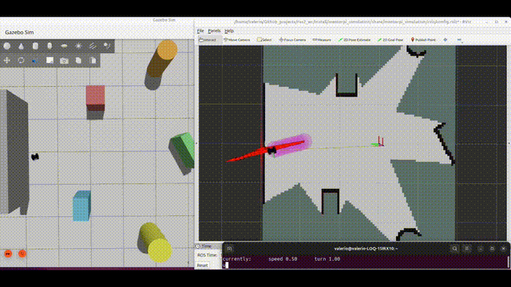

# 2D LiDAR SLAM MentorPi Gazebo

This project focuses on testing, in simulation, different localization and mapping approaches for a mobile robot.

The methods explored include:

- Differential odometry alone, with 3D point accumulation for map building
- Differential odometry used as input to a SLAM algorithm
- Kalman filtering for sensor fusion between differential odometry and IMU measurements, with 3D point accumulation for map building
- Kalman filtering for sensor fusion between differential odometry and IMU measurements, used as input to a SLAM algorithm

The robot used in this project is the Hiwonder MentorPi Mecanum, configured and used as a differential-drive robot. The simulation environment is Gazebo.

The next step is to test the system on the real robot hardware, using the motor drivers and onboard sensors.

## How to Run

```bash
ros2 launch mentorpi_simulation display.launch.py use_rviz:=True
```

## Results

A demonstration video is available on YouTube:

[2D LiDAR SLAM on a Simulated Mobile Robot](https://www.youtube.com/watch?v=UPGaf2nS698)

<br>

<p align="center">
  <b>2D LiDAR SLAM on Kalman inputs - </b><br>
  
</p>

<br>

