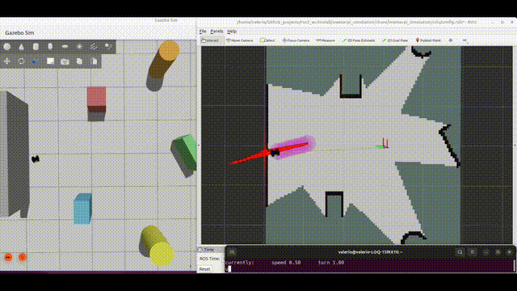
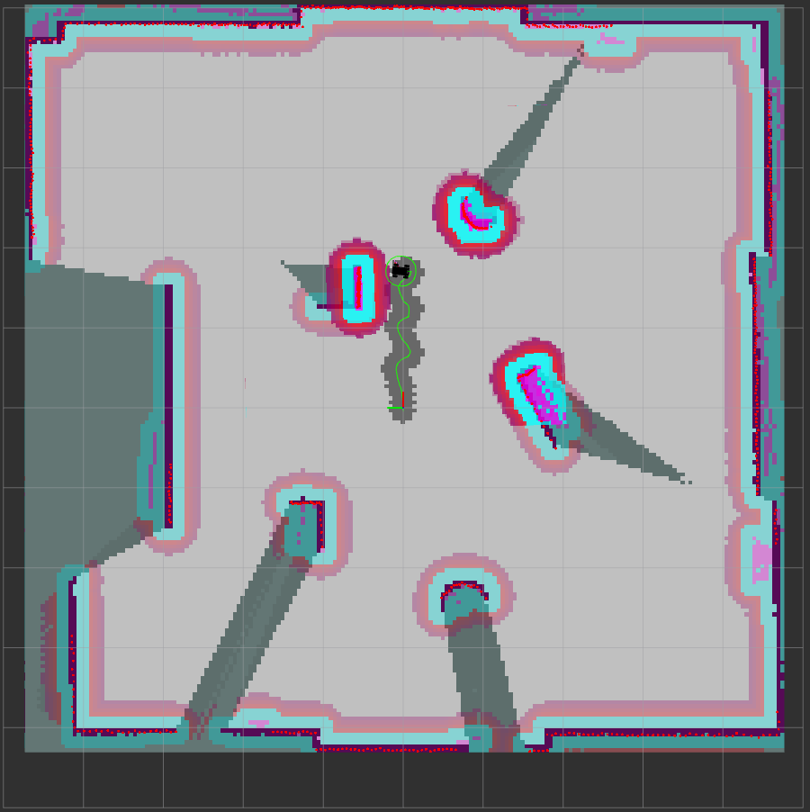

# MentorPi-Mecanum-Envs-Coverage

The first part of the project was focused on evaluating different localization and mapping approaches for a mobile robot, both in simulation and on real hardware.
The project was then expanded to achieve complete coverage of unknown environments (similar to how robot vacuums operate).

The robot used in this project is the Hiwonder MentorPi Mecanum, configured and used as a differential-drive robot.

The current stage involves testing the system on the robot's actual hardware, using the motor drivers and onboard sensors.


The methods explored include:

- Differential odometry alone, with 3D point accumulation for map building
- Differential odometry used as input to a SLAM algorithm
- Kalman filtering for sensor fusion between differential odometry and IMU measurements, with 3D point accumulation for map building
- Kalman filtering for sensor fusion between differential odometry and IMU measurements, used as input to a SLAM algorithm


## How to Run

```bash
ros2 launch mentorpi_simulation display.launch.py
```

## Results

A demonstration video is available on YouTube: [2D LiDAR SLAM on a Simulated Mobile Robot](https://www.youtube.com/watch?v=UPGaf2nS698)

<br>

<p align="center">
  <b> 2D LiDAR SLAM on Kalman inputs </b><br>
  
</p>

<br>
<br>

<p align="center">
  <b> Autonomous Environment Coverage with Nav2  </b><br>
  
</p>

<br>
